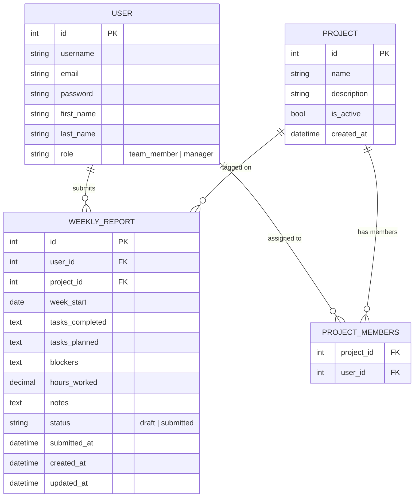

# Entity Relationship Diagram

```mermaid
erDiagram
    USER {
        int id PK
        string username
        string email
        string password
        string first_name
        string last_name
        string role "team_member | manager"
    }

    PROJECT {
        int id PK
        string name
        string description
        bool is_active
        datetime created_at
    }

    PROJECT_MEMBERS {
        int project_id FK
        int user_id FK
    }

    WEEKLY_REPORT {
        int id PK
        int user_id FK
        int project_id FK
        date week_start
        text tasks_completed
        text tasks_planned
        text blockers
        decimal hours_worked
        text notes
        string status "draft | submitted"
        datetime submitted_at
        datetime created_at
        datetime updated_at
    }

    USER ||--o{ WEEKLY_REPORT : "submits"
    PROJECT ||--o{ WEEKLY_REPORT : "tagged on"
    USER ||--o{ PROJECT_MEMBERS : "assigned to"
    PROJECT ||--o{ PROJECT_MEMBERS : "has members"
```

